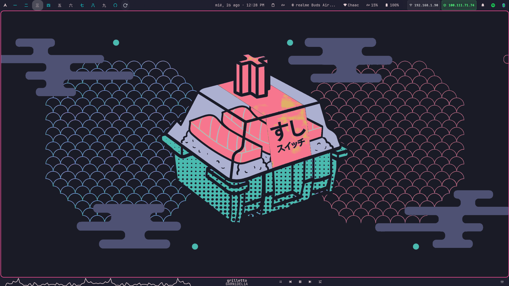
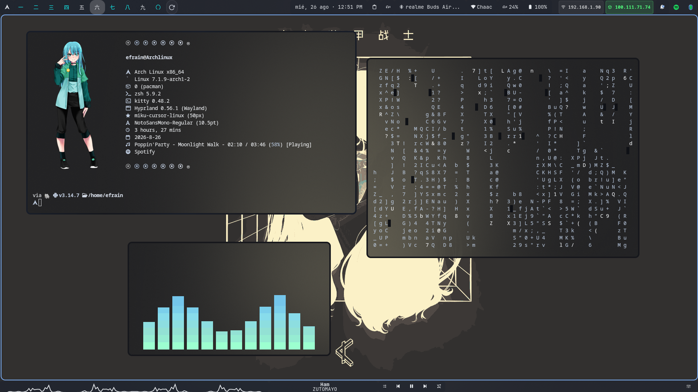
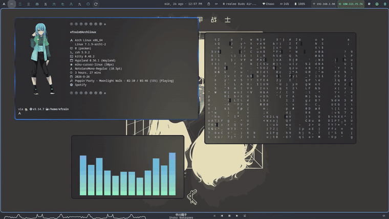
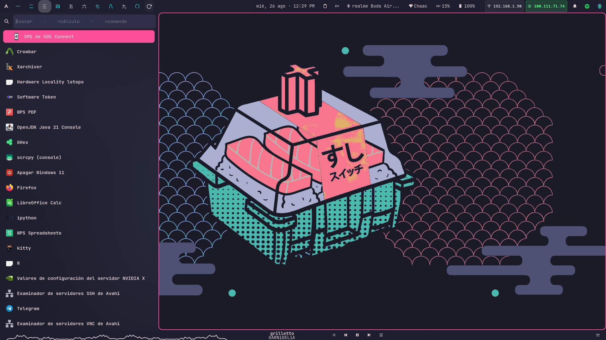
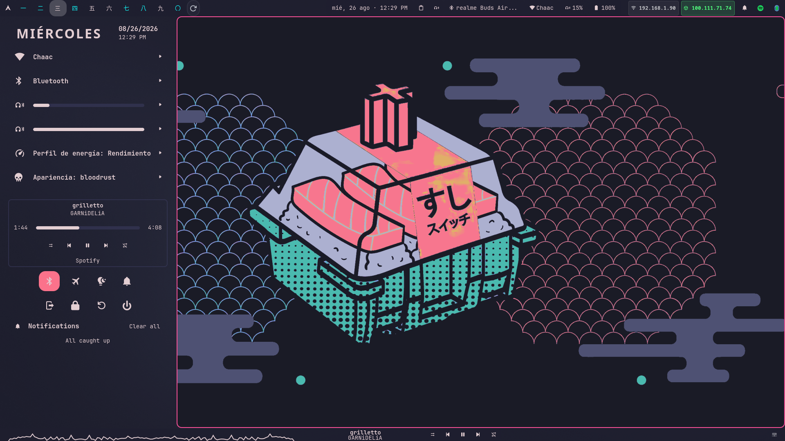
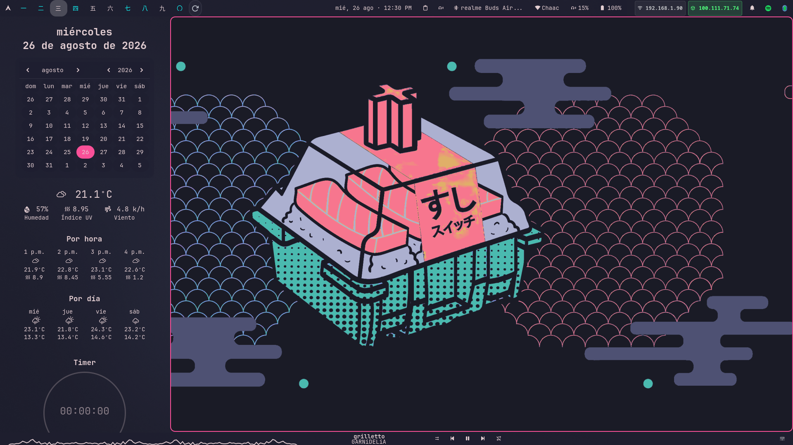
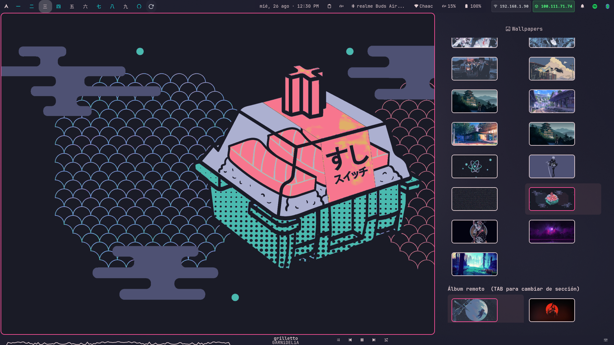
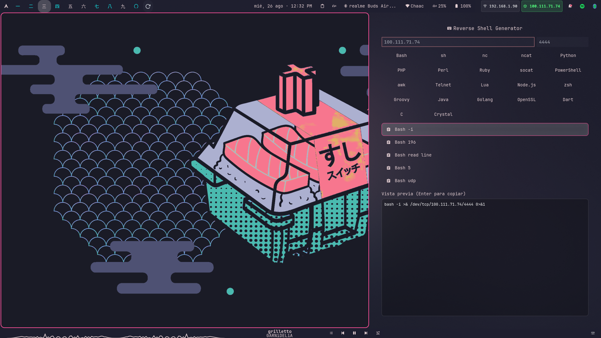
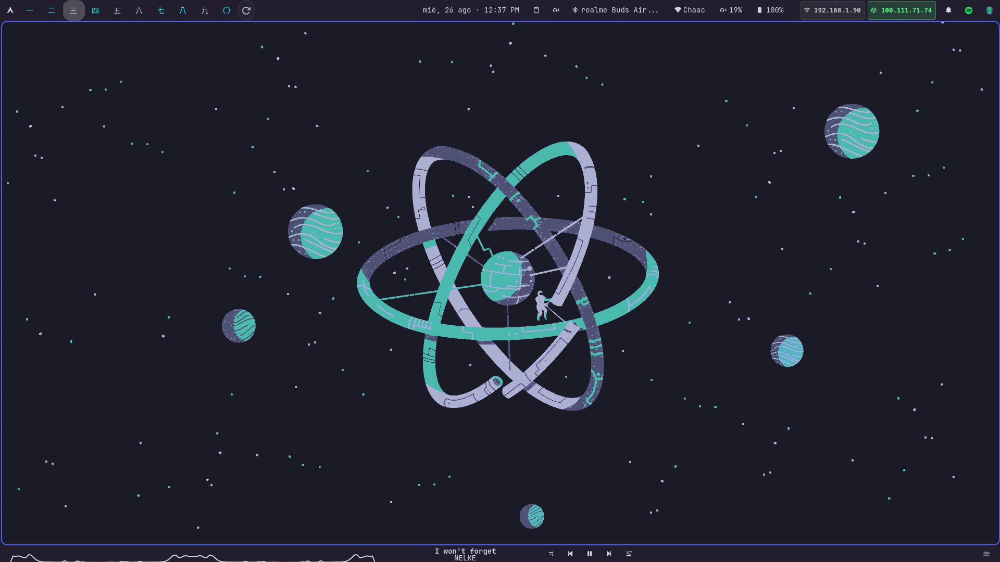
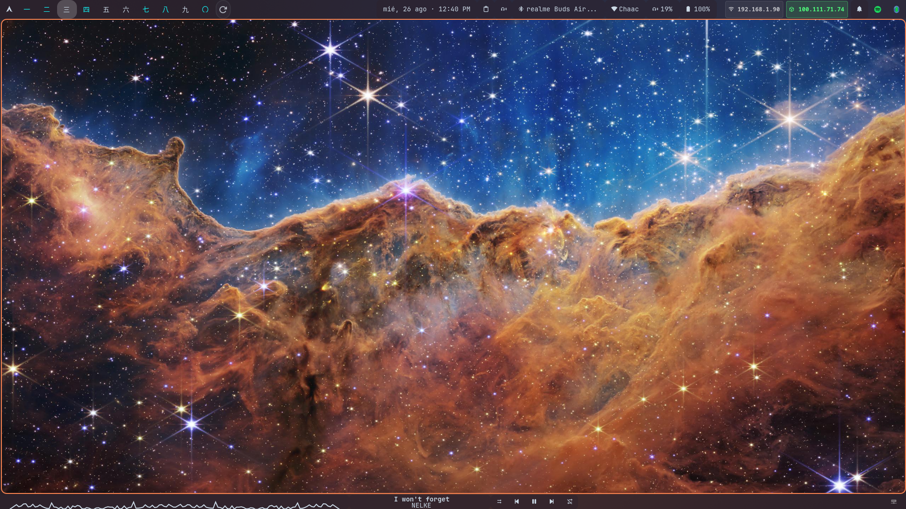

<div align="center">

# 🍣 dotfiles

**Arch Linux · Hyprland · OkPanel**

Mi escritorio completo — barra propia sobre AGS/Astal, tema dinámico *Material You* y flujo de pentest integrado.




</div>

## ✨ Características

- 🎨 **Tema dinámico** — los colores (barra, bordes, apps) se extraen del wallpaper con pywal.
- 📊 **Barra propia (OkPanel)** — construida sobre AGS/Astal: workspaces, red, bluetooth, audio, media, IPs.
- 🛡️ **Stack anti-crash** — parches propios de Astal para que el panel no se congele/crashee.
- 🖥️ **N monitores** — configuración genérica que auto-acomoda 2, 3, 4… monitores.
- 🐚 **Widgets de pentest** — generador de reverse shells, tracker de target, monitor de puertos.
- ⚡ **Config de Hyprland en Lua** (0.55+), lista para la deprecación de hyprlang en 0.57.

## 🎥 Demo en video

<!--
  ▸ Para que el video se REPRODUZCA aquí: edita este README en GitHub (rama
    dotfiles), arrastra el archivo ~/dotfiles-demo.mp4 justo debajo de esta
    línea, y haz commit. GitHub lo sube como user-attachment y lo vuelve un
    reproductor inline. (Un .mp4 commiteado al repo NO se reproduce inline.)
-->

*Recorrido completo por el escritorio, con música — súbelo arrastrándolo al editor del README en GitHub.*

## 📸 Galería

<div align="center">

*fastfetch · cmatrix · cava* — el clásico



*Navegación por teclado — el focus salta entre ventanas (Mod + hjkl / flechas):*



| App Launcher | Menú de sistema |
|:---:|:---:|
|  |  |
| **Calendario + clima** | **Selector de wallpapers** |
|  |  |

**Reverse Shell Generator** *(estilo revshells.com, integrado en la barra)*



### 🌈 Tema dinámico

Cambias el wallpaper y **todo el entorno se recolorea solo** (barra, bordes, menús, apps) con
pywal — sin tocar un solo archivo. El mismo escritorio, tres wallpapers:

| 🍣 Rosa/teal | 🌌 Teal/azul | 🔭 Naranja |
|:---:|:---:|:---:|
|  |  |  |

</div>

> Esta rama (`dotfiles`) reúne **todo en un solo lugar**. Otras ramas del repo:
> `master` = OkPanel como proyecto publicable · `varda-theme` = repo del sistema de temas.

---

## 🚀 Instalación automática

En una máquina nueva de Arch Linux (con Hyprland y `yay` ya instalados):

```bash
git clone -b dotfiles https://github.com/Ckabos/dotfiles.git
cd dotfiles && ./install.sh
```

El `install.sh` hace, en orden:
1. Instala las **dependencias** (paquetes).
2. Copia las **configs** a `~/.config` y `~` (**respaldando** las previas en `~/.dotfiles-backup-*`).
3. Instala **OkPanel** en `~/OkPanel` + `~/.local/bin`.
4. Compila e instala los **parches de Astal** (anti-crash) y los **fija** en `/etc/pacman.conf`.
5. Deshabilita `okpanel.service` de systemd (lo lanza Hyprland).
6. Clona el sistema de temas (**Varda-Theme**).

> Requiere `yay`. Pide `sudo` para `pacman` y `pacman.conf`. **No borra datos**: respalda lo previo.
> Al terminar lista los **pasos manuales** que faltan (secretos, wallpapers, fuentes) — ver más abajo.

### Instalación manual (si prefieres paso a paso)

Ver la sección **🛡️ Stack anti-crash** para los parches, y estos manuales que el script también recuerda:
- **Secretos:** crea `~/.config/zsh/secrets.zsh` (API key, `chmod 600`) y recrea tus llaves SSH.
- **Wallpapers:** cópialos a `~/Imágenes/Wallpapers`.
- **Fuentes/tema:** Anurati (manual), cursor miku; luego `~/Varda-Theme/themes/setTheme.sh <tema>`.

---

## 📁 Estructura

```
.config/
├── hypr/         Hyprland — config en Lua (0.55+): keybinds, monitores, arranque, tema dinámico
├── OkPanel/      temas/config de la barra (el proyecto vive en ./OkPanel y en la rama master)
├── systemd/user/ servicios: okpanel.service (límites de RAM), wallpaper-rotator.service
├── fontconfig/   fix de fuentes WPS (Cambria/Candara)
├── kitty/ rofi/ wal/            terminal, launcher, pywal (color dinámico)
├── yazi/ ranger/ nvim/          gestores de archivos, editor
├── cava/ btop/ fastfetch/ cliphist/
OkPanel/          proyecto AGS/Astal de la barra (incluye contrib/ con los parches)
.zshrc .zprofile .bashrc .gitconfig
```

Los **secretos** (API keys, llaves SSH, `*.secret.env`) están **fuera del repo por diseño** — ver `.gitignore`.

---

## 🛡️ Stack anti-crash (IMPORTANTE para que el sistema no truene)

OkPanel corre sobre las librerías **Astal**, que tienen dos bugs que tumbaban el panel entero.
Los parches viven en **`OkPanel/contrib/`** y son **indispensables**:

| Parche | Qué arregla |
|---|---|
| `libastal-hyprland-utf8fix` | El panel se **congelaba** con títulos de ventana no-UTF8 (WPS Office abriendo archivos con acento). Sanea el JSON del IPC de Hyprland. |
| `libastal-network-bssid-fix` | El panel **crasheaba (SIGSEGV)** en redes wifi densas: Astal indexa APs por BSSID y `nm_access_point_get_bssid()` puede devolver NULL. Descarta los APs sin BSSID. |

### Instalar los parches

```sh
cd OkPanel/contrib/libastal-hyprland-utf8fix   && makepkg -f && sudo pacman -U *.pkg.tar.zst
cd ../libastal-network-bssid-fix               && makepkg -f --holdver && sudo pacman -U *.pkg.tar.zst
```

### FIJAR las versiones parcheadas (si no, `yay -Syu` las revierte)

En `/etc/pacman.conf`:

```ini
IgnorePkg = libastal-hyprland-git libastal-network-git hyprland
```

(`hyprland` fijado en 0.56.1 hasta migrar del todo; la config ya está en Lua para 0.57.)

### Límites de RAM del panel

`okpanel.service` incluye `MemoryHigh=1800M` / `MemoryMax=2500M` para acotar el consumo de gjs.
Se lanza desde Hyprland (`exec-once`), **no** por systemd (evita la carrera de arranque):

```sh
systemctl --user disable okpanel.service   # que lo lance Hyprland, no systemd
```

---

## 🎨 Notas de la config

- **Hyprland en Lua:** migrado de `.conf` (hyprlang, deprecado en 0.57) a Lua. Los `.conf` originales quedan como respaldo/rollback (`rm ~/.config/hypr/hyprland.lua` vuelve al `.conf`).
- **Monitores genéricos:** regla comodín (output vacío) auto-configura N monitores; layout fijo `DP-2 | eDP-1 | HDMI-A-1`. Mover workspace al siguiente monitor: `Mod+T` (relativo `+1`, cicla por todos).
- **Tema dinámico:** `wallpaperUpdate.sh` y `setTheme.sh` (repo Varda-Theme) generan `conf/theme.lua` con los colores del wallpaper.
- **Fuentes WPS:** `fontconfig/conf.d/50-wps-office-fonts.conf` + `ttf-vista-fonts` arreglan Cambria/Candara faltantes.

---

## 📦 Assets fuera del repo (se instalan/generan aparte)

Temas por app, cursores (miku), iconos, fuentes y wallpapers no se versionan aquí (son GB de binarios).
El sistema de temas y sus scripts viven en el repo **Varda-Theme** (rama `varda-theme`).
